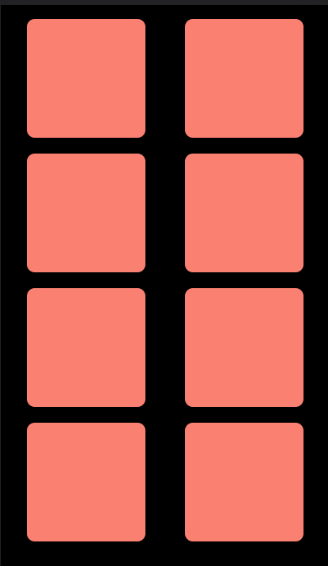

Implement a grid based layout in HTML such that:

1. On wider screens like laptops and monitors, the grid is 4 columns wide.
   

2. On medium screens like tablets, the grid is 2 columns wide.
   

3. On smaller screens like mobile phones,the grid is single column wide.
   
